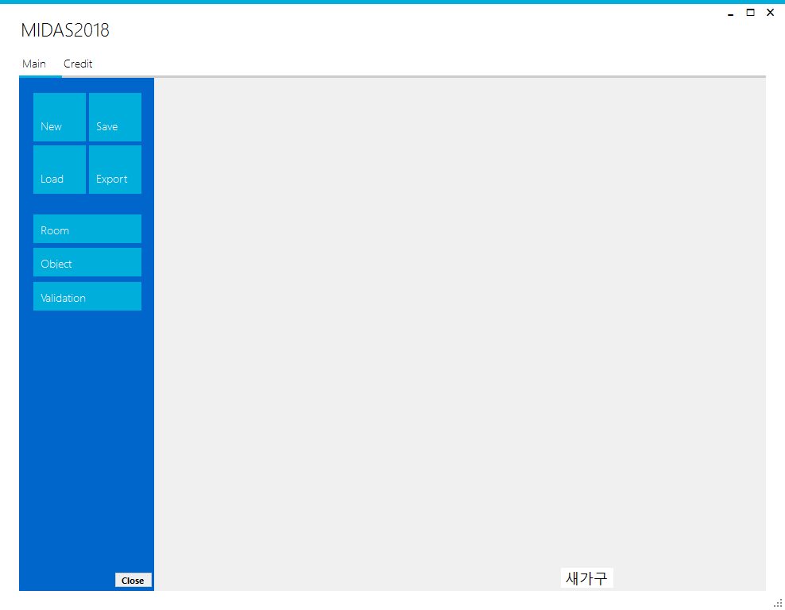

# MidasChallenge2018MainStage

## 주제 : 인테리어 프로그램.

개발환경 : winform(gdi+), VS2017

개발시간 : 24h.

결과 : 입상 실패

실행화면

## 구현파트

### 김기원(geniikw) - mainframe 

  시스템기획

  잡다한거 구현(IO, Undo, Menu,...)
    
### 최재영 - logic

  폐쇄공간탐색.
  
  방의 위치에 따른 내부벽의 위치 생성.
  
### 고대영 - view

  방,오브젝트의 위치나 크기 조작
  
  각 방이나 오브젝트의 위치에 따른 부모자식관계 설정
 
 
 
